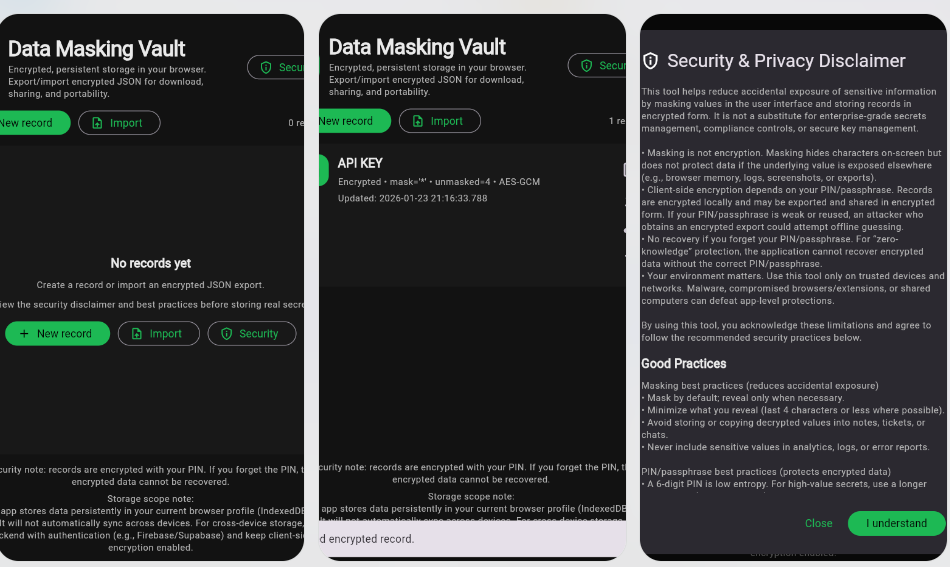
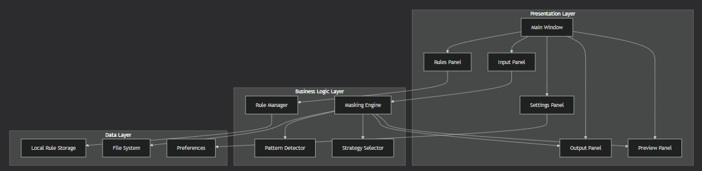
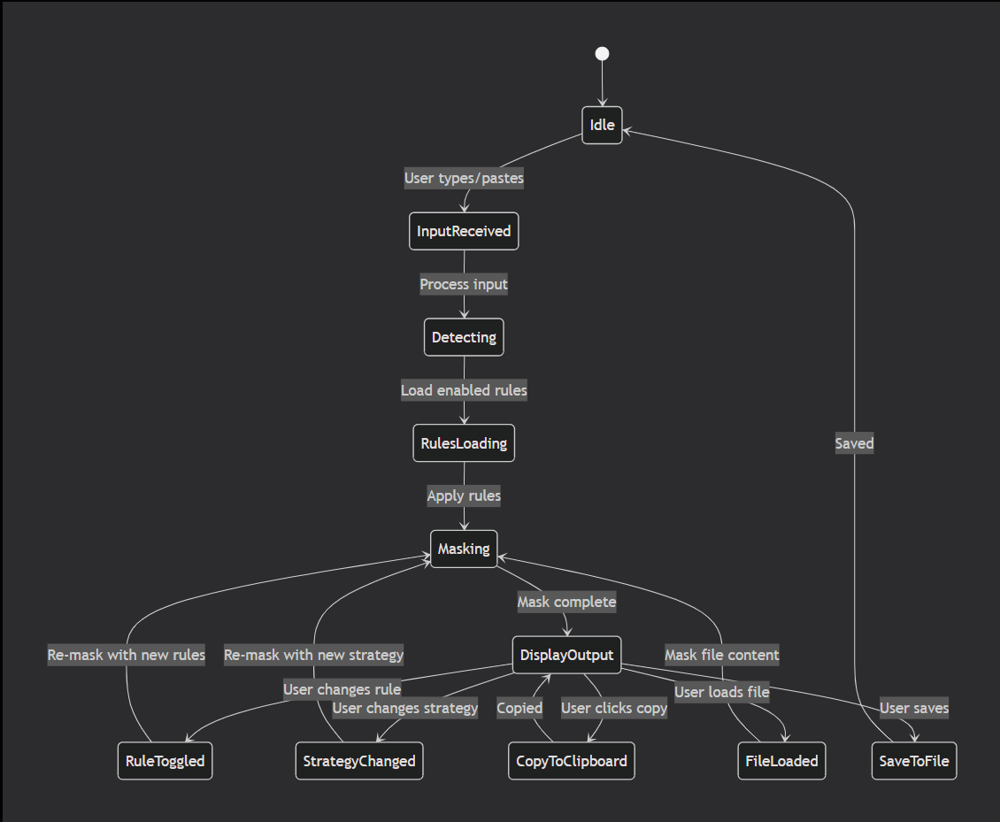

# 🛡️ Data Masking Toolkit

> **Protect sensitive data instantly with powerful masking, anonymization, and transformation tools.**


---


## 🎯 Hero Section

**Data Masking Toolkit** is a secure desktop application that helps developers, testers, and organizations anonymize sensitive data in real time.

💡 *Mask it before you leak it.*

### Why Data Masking Toolkit?

| Problem | Solution |
|---------|----------|
| ❌ Sensitive data exposed in logs | ✅ **Instant masking** – protect before storage |
| ❌ Production data used in testing | ✅ **Anonymize** – realistic but safe data |
| ❌ GDPR/PCI compliance risks | ✅ **Compliant** – meet regulatory requirements |
| ❌ Manual data redaction | ✅ **Automated** – pattern-based detection |

### 🖼️ Visuals




---

## 🧩 Project Overview & Problem Statement

### ❗ The Problem

Sensitive data (emails, credit cards, personal info) is often:

| Issue | Impact |
|-------|--------|
| ❌ **Exposed in logs** | Debug logs contain PII, leaked to unauthorized viewers |
| ❌ **Used in testing environments** | Production data copied to dev/test with real PII |
| ❌ **Shared insecurely** | Screenshots, support tickets expose customer data |
| ❌ **Left in code comments** | Hardcoded credentials, test data in source control |

**This creates:**

- 🚨 **Security risks** – Data breaches, identity theft
- ⚖️ **Compliance violations** – GDPR fines up to €20M or 4% of revenue
- 💸 **Financial losses** – Breach remediation costs average $4.45M
- 📉 **Reputation damage** – Loss of customer trust

### 📊 The Cost of Data Exposure
┌─────────────────────────────────────────────────────────────────┐
│ GDPR Fine: up to €20 million │
│ Average Breach Cost: $4.45 million (IBM 2023) │
│ Time to Detect Breach: 207 days average │
│ Customers Lost After Breach: 25% on average │
└─────────────────────────────────────────────────────────────────┘

### ✅ The Solution

**Data Masking Toolkit** provides a secure, local-first solution to protect sensitive data:

- 🔒 **Real-time masking** – Instantly anonymize data as you type
- 🧠 **Smart pattern detection** – Automatically identify PII (emails, phones, cards, SSNs)
- ⚡ **Zero data leakage** – Everything processes locally on your machine
- 📂 **File support** – Mask entire files (JSON, CSV, TXT, logs)
- 🔧 **Custom rules** – Define your own masking patterns
- 📊 **Preview before/after** – See exactly what will be masked

---

## ✨ Key Features

### Core Features

| Feature | Description | Status |
|---------|-------------|--------|
| 🔒 **Data Masking Engine** | Core masking functionality with multiple strategies | ✅ Complete |
| 🧠 **Pattern Detection** | Auto-detect emails, phones, credit cards, SSNs, IPs | ✅ Complete |
| ⚡ **Real-time Processing** | Mask as you type, instant feedback | ✅ Complete |
| 📂 **File Masking Support** | Process JSON, CSV, TXT, XML, log files | ✅ Complete |
| 🔧 **Custom Rules** | User-defined regex patterns with custom replacements | ✅ Complete |
| 💾 **Offline-first** | 100% local processing – no data leaves device | ✅ Complete |
| 📊 **Preview Before/After** | Side-by-side comparison | ✅ Complete |
| 📋 **Clipboard Integration** | Copy masked output with one click | ✅ Complete |
| 🔄 **Batch Processing** | Mask multiple files at once | 🚧 In Progress |
| 📁 **Folder Watch** | Auto-mask files in watched directory | 📋 Planned |

### Masking Strategies

| Strategy | Example Input | Example Output | Use Case |
|----------|--------------|----------------|----------|
| **Redaction** | john.doe@email.com | [REDACTED] | Maximum security |
| **Partial Masking** | john.doe@email.com | j***@e******.com | Usable for support |
| **Format Preserving** | 4111-1111-1111-1111 | ****-****-****-1111 | Keep last 4 digits |
| **Pseudonymization** | john.doe@email.com | user_7f3a8e2b@anon.com | Reversible with mapping |
| **Nulling** | john.doe@email.com | (empty string) | Remove entirely |
| **Custom Pattern** | Any format | User-defined | Specific requirements |

### Supported Data Types

| Data Type | Pattern | Default Mask |
|-----------|---------|--------------|
| 📧 **Email Address** | `user@domain.com` | `u***@d****.com` |
| 📞 **Phone Number** | `+1 (555) 123-4567` | `+1 (***) ***-****` |
| 💳 **Credit Card** | `4111-1111-1111-1111` | `****-****-****-1111` |
| 🆔 **SSN** | `123-45-6789` | `***-**-6789` |
| 🌐 **IP Address** | `192.168.1.100` | `192.168.*.*` |
| 🔑 **API Key** | `sk-abc123...` | `sk-****...****` |
| 👤 **Name** | `John Smith` | `J*** S***` |
| 📍 **Address** | `123 Main St` | `*** *** St` |

---

## 🛠️ Tech Stack

### Frontend

| Technology | Purpose | Why Chosen |
|------------|---------|-------------|
| **Flutter (Dart)** | Cross-platform UI framework | Fast rendering, desktop support |
| **Material Design 3** | UI components & theming | Modern, accessible design |
| **Riverpod** | State management | Reactive, testable |

### Backend

| Technology | Purpose |
|------------|---------|
| ❌ **None** | Local processing only – no network calls |

### Core Logic

| Component | Technology | Purpose |
|-----------|------------|---------|
| **Pattern Detection** | Regex (RegExp) | Flexible, fast pattern matching |
| **Masking Engine** | Custom Dart logic | Multiple masking strategies |
| **File Processing** | Dart:io | Read/write local files |

### Storage

| Technology | Purpose |
|------------|---------|
| **Hive** | Store custom masking rules |
| **SharedPreferences** | User preferences and settings |

### Development Tools

| Tool | Purpose |
|------|---------|
| **Flutter SDK 3.x** | Core framework |
| **Dart SDK 3.x** | Programming language |
| **Visual Studio 2022** | Windows build tools |
| **Xcode** | macOS build tools |

### Reasoning

- 🔐 **Local-first** = Maximum privacy, no data leaks
- ⚡ **Flutter** = Fast UI with hot reload
- 🧠 **Regex** = Flexible pattern detection
- 📦 **No dependencies** = Minimal attack surface

---

## 🏗️ Architecture & Data Flow

## UML Component Architecture

## State Management Flow

### 🔄 Data Flow Diagram

```mermaid
flowchart LR
    subgraph Input Sources
        A[Text Input]
        B[File Upload]
        C[Paste from Clipboard]
        D[Drag & Drop]
    end
    
    subgraph Processing
        E[Input Validation]
        F[Pattern Detection]
        G[Masking Engine]
        H[Rule Application]
    end
    
    subgraph Output
        I[Masked Text]
        J[Preview Display]
        K[Copy to Clipboard]
        L[Save to File]
    end
    
    A --> E
    B --> E
    C --> E
    D --> E
    
    E --> F
    F --> G
    G --> H
    
    H --> I
    I --> J
    I --> K
    I --> L
